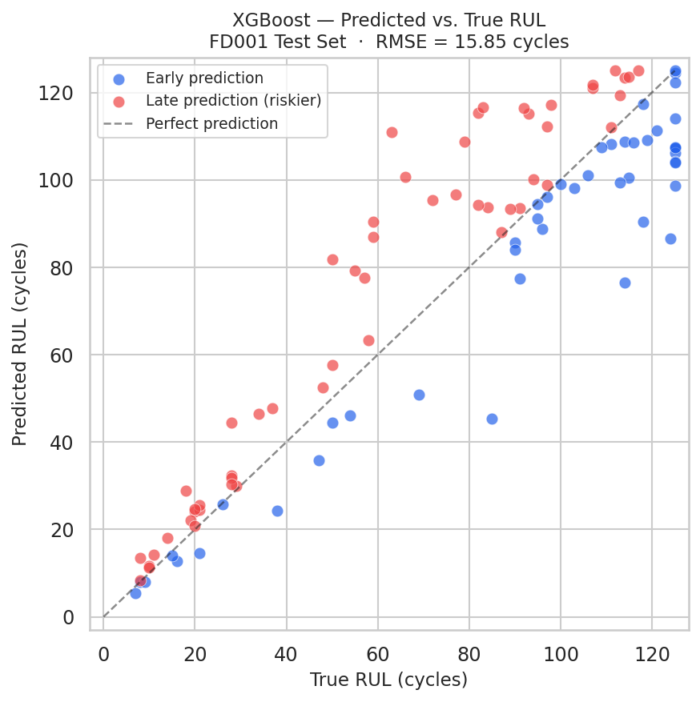
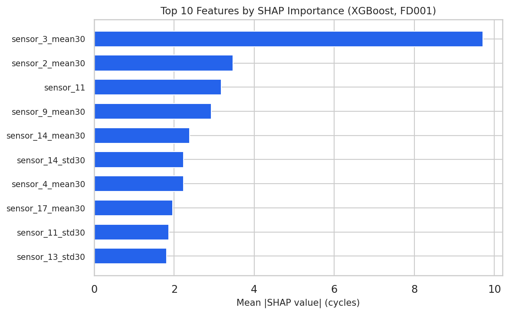
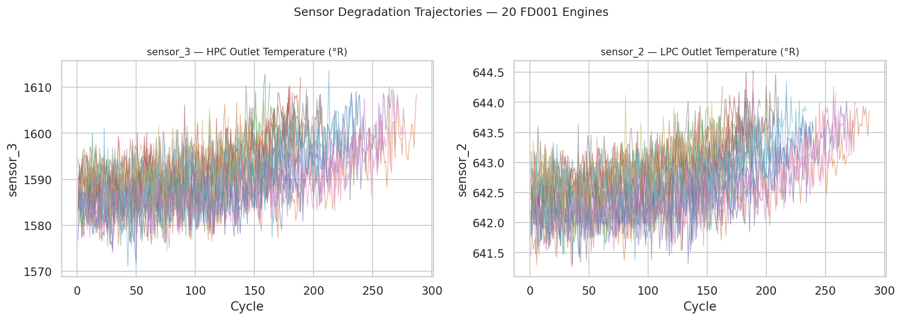
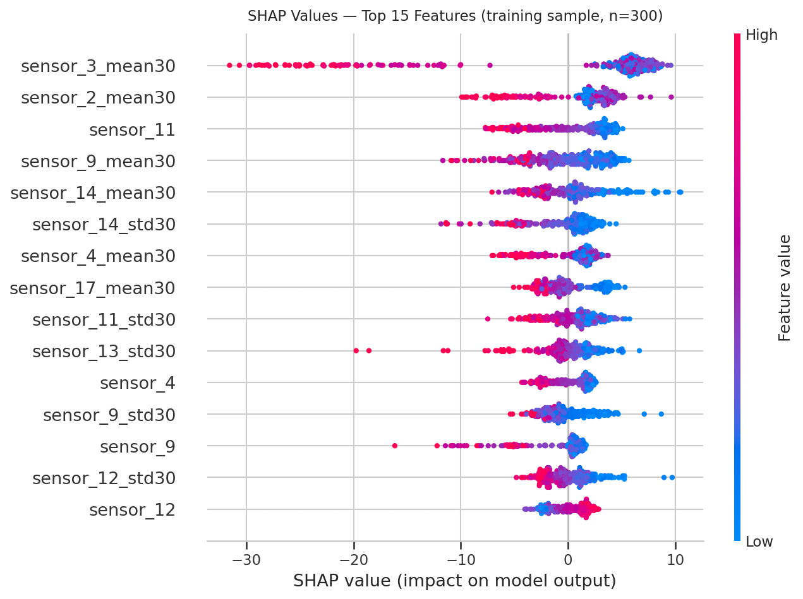

# Turbofan Engine RUL Prediction — NASA CMAPSS

[](https://www.python.org/)
[](https://xgboost.readthedocs.io/)
[](https://shap.readthedocs.io/)
[](https://fastapi.tiangolo.com/)
[](LICENSE)
[]()

> **Given a sequence of turbofan sensor readings, predict cycles remaining before engine failure. Per-prediction SHAP explanations map directly to known HPC degradation physics.**

🔗 **[Live Demo](https://turbofan.alvinalias.com)** &nbsp;|&nbsp; 📡 **[API Docs](https://cmapss-rul-api.onrender.com/docs)**

---

## Key Results

| Model | RMSE (FD001 test set) | Reference |
|-------|----------------------|-----------|
| Babu et al. 2016 — CNN | 18.45 | First CNN for RUL on CMAPSS |
| Ridge Regression (baseline) | 17.47 | This project's linear baseline |
| Zheng et al. 2017 — deep LSTM | 16.14 | Widely-cited sequence-model benchmark |
| **XGBoost + rolling features** | **15.85 ✓** | **This project** |

**XGBoost edges out the widely-cited Zheng et al. 2017 deep LSTM (16.14) and clears the Babu et al. 2016 CNN (18.45) — using only tabular features, no recurrent networks or sequence padding.** Recent transformer and hybrid CNN-LSTM architectures have since pushed FD001 below ~14 RMSE, so 15.85 is a strong *classical-ML* result rather than current state of the art — a distinction worth stating plainly in an interview.

**Dataset snapshot:** 100 engines × run-to-failure · 20,631 training cycles · 14 informative sensors after dropping 7 near-zero-variance channels · single operating condition (FD001) · RUL capped at 125 cycles per industry convention

<p align="center">
  
  &nbsp;&nbsp;
  
</p>

---

## What Makes This Interesting

**Temporal leakage is the silent killer of sensor-based regression.** A random 80/20 split on this dataset would guarantee data leakage — cycles from the same engine span both train and test, so the model memorizes engine-level drift rather than learning a generalizable degradation pattern. This project splits strictly by engine unit, the only correct approach for time-series sensor data.

**Domain knowledge drives the features, not just statistics.** The 7 sensors dropped for near-zero variance were identified by variance analysis and cross-referenced against the CMAPSS dataset description (Saxena & Goebel 2008). The 30-cycle rolling window was chosen to span roughly one HPC fouling cycle, not tuned by grid search. When SHAP identifies rising temperature sensors as the dominant RUL driver, that maps to a known physical mechanism: thermal degradation from compressor fouling — not just a pattern the model found.

**The full stack is production-shaped.** The model lives behind a FastAPI endpoint that validates inputs with Pydantic before any Python runs, returns a confidence band alongside the point estimate, and serves SHAP explanations per request. The frontend is deployed on Vercel as a static site — no framework, no build step — and the backend on Render with a Blueprint `render.yaml` so deployment is a single button click.

**SHAP output maps to real physics, not just feature rankings.** The top SHAP feature — `sensor_3_mean30`, the 30-cycle rolling mean of HPC outlet temperature — is the primary thermodynamic signature of compressor fouling in FD001. As the HPC fouls, compressor efficiency drops, outlet temperature rises, and remaining life shortens. The model learned this causal chain from data; SHAP makes it legible. Features 2–5 (`sensor_2_mean30`, `sensor_11`, `sensor_9_mean30`, `sensor_14_mean30`) are the correlated upstream and downstream sensors that respond to the same fault propagating through the engine.

<p align="center">
  
</p>

*Above: sensor_3 (HPC outlet temperature) and sensor_2 (LPC outlet temperature) plotted over full engine lifetimes for 20 training engines. The upward drift — noisy cycle-to-cycle but clear over 30-cycle windows — is what the rolling mean feature captures and the model uses as its primary RUL signal.*

<p align="center">
  
</p>

*Above: SHAP beeswarm for the top 15 features across 300 training samples. Red = high feature value, blue = low. For `sensor_3_mean30`: red dots (high temperature) push predictions left (shorter RUL) — the expected signature of HPC fouling.*

---

## Architecture

```
frontend/          →  Vercel (static site, no build step)
api/               →  Render (FastAPI Python backend)
src/               →  Shared feature engineering + model logic
notebooks/         →  EDA, feature engineering, training (exploratory)
```

```
User uploads CSV
      ↓
frontend/app.js  →  POST /predict  →  api/predictor.py
                                            ↓
                                    Feature engineering
                                    XGBoost inference
                                    SHAP explanation
                                            ↓
                              JSON response → rendered in browser
```

---

## Dataset

- **Source:** NASA CMAPSS (Commercial Modular Aero-Propulsion System Simulation), Saxena & Goebel 2008
- **Subset:** FD001 — single operating condition, single fault mode (HPC degradation)
- **Size:** 100 engines × run-to-failure, 21 sensors per cycle, 20,631 training rows
- **RUL cap:** 125 cycles — the standard piecewise-linear assumption. Engines with more than 125 cycles remaining are treated as equally healthy operationally; without the cap, very early cycles dominate training and distort the learned degradation curve.

---

## Approach

| Step | What | Why |
|------|------|-----|
| Sensor filtering | Drop 7 near-constant sensors | Near-zero variance = zero predictive signal; confirmed by variance analysis cross-referenced with Saxena & Goebel dataset description |
| Feature engineering | Rolling mean + std over 30-cycle window per engine | Smooths sensor noise; captures the degradation *trend* rather than instantaneous noise |
| Train/test split | Grouped by engine unit | Prevents temporal leakage — cycles from the same engine must stay in the same split |
| Baseline | Ridge regression (L2-regularized) | Establishes a meaningful lower bound for RMSE; L2 stabilizes correlated rolling features |
| Primary model | XGBoost regressor | Industry-standard for tabular; fast inference; native exact TreeSHAP support |
| Interpretability | Exact TreeSHAP (XGBoost `pred_contribs`) | Per-prediction feature attribution without the shap package's XGBoost 3.x loader incompatibility; maps dominant features back to known HPC degradation mechanisms |
| API | FastAPI on Render | Clean JSON interface; Pydantic validation; auto-generated `/docs` Swagger UI |
| Frontend | Vanilla HTML/CSS/JS on Vercel | Professional UI without framework overhead; full control over UX |

---

## Setup and How to Run

### 1. Create the environment

```bash
conda env create -f environment.yml
conda activate cmapss-rul
```

### 2. Get the data

Place the following files in `data/raw/` (space-separated, no header row):

```
data/raw/train_FD001.txt
data/raw/test_FD001.txt
data/raw/RUL_FD001.txt
```

Download from [NASA PCOE](https://www.nasa.gov/intelligent-systems-division/discovery-and-systems-health/pcoe/pcoe-data-set-repository/) or the [Kaggle mirror](https://www.kaggle.com/datasets/behrad3d/nasa-cmaps). The `data/raw/` directory is gitignored — these files are not in the repo.

### 3. Run the notebooks in order

```bash
jupyter notebook
```

| Notebook | Purpose |
|----------|---------|
| `01_eda.ipynb` | Sensor distributions, degradation trajectories, variance analysis, RUL distribution |
| `02_feature_engineering.ipynb` | Rolling features, feature validation, export processed data |
| `03_modeling.ipynb` | Grouped split, baseline LR, XGBoost, SHAP analysis, save `models/xgb_rul.joblib` |

### 4. Start the API locally

```bash
uvicorn api.main:app --reload
# API: http://localhost:8000
# Interactive docs: http://localhost:8000/docs
```

### 5. Open the frontend

Open `frontend/index.html` in a browser (or use VS Code Live Server). Update `API_BASE` in `frontend/app.js` to `http://localhost:8000` for local testing.

---

## Deployment

### Backend — Render

The repo ships with a `render.yaml` Blueprint and a `runtime.txt` pinning Python 3.11.9.

1. Push the repo to GitHub.
2. On Render: **New + → Blueprint** → connect this repo. Render reads `render.yaml` and provisions the service automatically (build command, start command, health check, Python version).
3. Manual fallback (Render dashboard):
   - Build: `pip install -r requirements.txt`
   - Start: `uvicorn api.main:app --host 0.0.0.0 --port $PORT`
   - Health check path: `/health`

### Frontend — Vercel

1. Import the GitHub repo on Vercel.
2. Set root directory to `frontend/`.
3. No build step — deploy as static files.
4. Update `API_BASE` in `app.js` to your Render URL before pushing.
5. After deploying, update the `allow_origins` list in `api/main.py` with your Vercel URL and redeploy the backend.

---

## Project Structure

```
.
├── environment.yml          ← Local dev (conda, Python 3.11)
├── requirements.txt         ← Deployment deps (pip, Render)
├── runtime.txt              ← Python version pin (Render)
├── render.yaml              ← Render Blueprint manifest
├── .gitignore
│
├── data/
│   └── raw/                 ← gitignored — download from NASA PCOE
│       ├── train_FD001.txt
│       ├── test_FD001.txt
│       └── RUL_FD001.txt
│
├── figures/                 ← Generated plots embedded in this README
│   ├── 01_degradation_trajectories.png
│   ├── 02_predicted_vs_actual.png
│   ├── 03_shap_summary.png
│   └── 04_shap_bar.png
│
├── notebooks/               ← Run in order — each builds on the previous
│   ├── 01_eda.ipynb         ← Sensor EDA, degradation trajectories, variance analysis
│   ├── 02_feature_engineering.ipynb  ← Rolling features, train/test alignment, validation
│   └── 03_modeling.ipynb    ← Grouped split, Ridge baseline, XGBoost, SHAP, model save
│
├── src/                     ← Shared Python modules (used by notebooks and API)
│   ├── features.py          ← Data loading, RUL labeling, rolling feature pipeline
│   ├── model.py             ← XGBoost training, grouped split, evaluation
│   └── utils.py             ← Plotting helpers (degradation trajectories, RUL histogram)
│
├── api/                     ← FastAPI backend → Render
│   ├── main.py              ← Routes, CORS, lifespan model loading
│   ├── schemas.py           ← Pydantic request/response models
│   └── predictor.py         ← Model loading, inference, SHAP explanations
│
├── frontend/                ← Static site → Vercel
│   ├── index.html
│   ├── style.css
│   ├── app.js               ← CSV parsing, API call, RUL gauge, SHAP bars
│   └── sample_engine.csv    ← Demo file — try the upload flow without your own data
│
└── models/
    ├── .gitkeep
    └── xgb_rul.joblib       ← trained artifact used by Render API
```

---

## References

- Saxena, A., & Goebel, K. (2008). *Turbofan Engine Degradation Simulation Data Set.* NASA Ames Prognostics Data Repository. [[link]](https://www.nasa.gov/intelligent-systems-division/discovery-and-systems-health/pcoe/pcoe-data-set-repository/)
- Saxena, A., Goebel, K., Larrosa, C., & Luo, J. (2010). *Metrics for Evaluating Performance of Prognostic Techniques.* International Conference on Prognostics and Health Management.
- Chen, T., & Guestrin, C. (2016). *XGBoost: A Scalable Tree Boosting System.* KDD 2016. [[arXiv]](https://arxiv.org/abs/1603.02754)
- Lundberg, S. M., & Lee, S.-I. (2017). *A Unified Approach to Interpreting Model Predictions.* NeurIPS 2017. [[arXiv]](https://arxiv.org/abs/1705.07874)
- Lundberg, S. M., et al. (2020). *From Local Explanations to Global Understanding with Explainable AI for Trees.* Nature Machine Intelligence. [[arXiv]](https://arxiv.org/abs/1905.04610)

---

*Built by Alvin Alias · MS Data Science, University of Washington · 2026*
